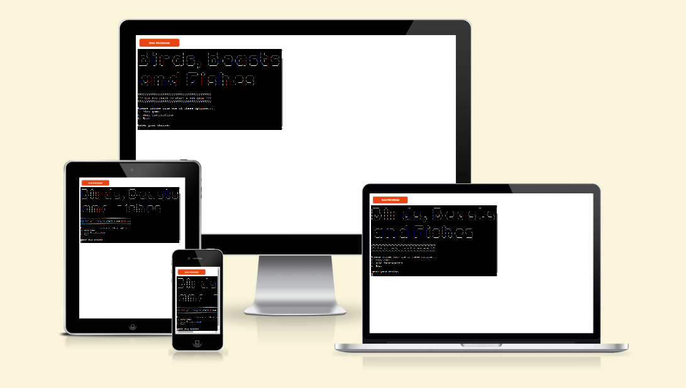
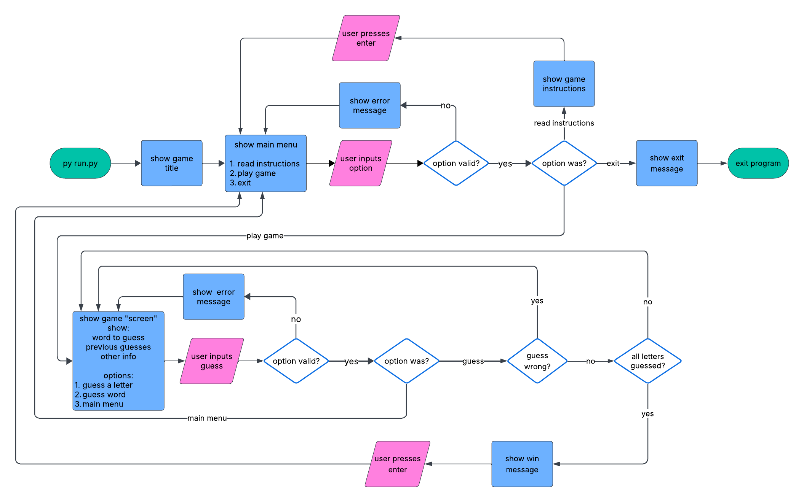
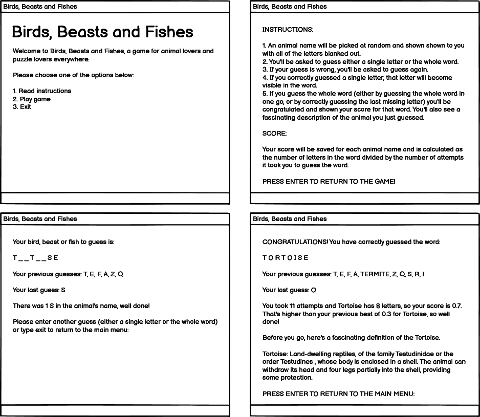
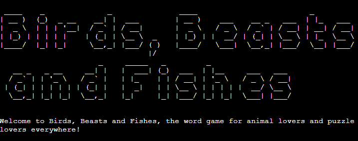
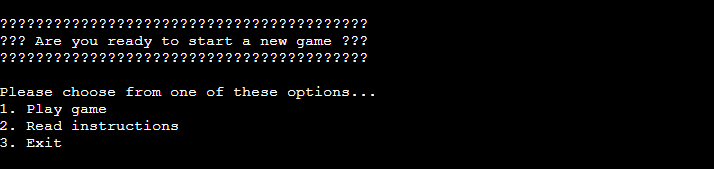

# Birds, Beasts and Fishes

- [Birds, Beasts and Fishes (play the game on Heroku)](https://birds-beasts-fishes-428a18feeb9b.herokuapp.com/) 

Birds, Beasts and Fishes is a command line word game for children of (almost) all ages.

It is based on a chalk-and-slate game of the same name, described in Alice Gomme’s 1894 book, The Traditional Games of England, Scotland and Ireland.

You can read [the original 1894 description](https://www.gutenberg.org/files/41727/41727-h/41727-h.htm#GameI_50)  online, thanks The Gutenberg Project.

The game is similar to the more popular Hangman game. The player is given a word with all of the letters blanked out, except for the first and last letter. The player guesses either single letters or the whole word, with the aim being to guess the word in as few guesses as possible.

As the title suggests, all words are the names of birds, beasts or fishes (or animals more generally). In addition to just being fun, the game aims to get more children interested in the natural world, animals, language and the joy of solving puzzles.

## User Experience Design

I designed the program using the "five planes" UX design process.

### Strategic Plane

#### Product Owner Goals

- Primary goal:
  - To inspire children of (almost) all ages to take an interest in the natural world, animals, language and puzzles
- Secondary goals:
  - To improve the player’s spelling skills
  - To give players a calming way to enjoy their spare time.

#### User goals

- Primary goal:
  - To play a fun game
- Secondary goals:
  - To test their spelling abilities
  - To learn some new facts about animals
  - To have an alternative to hyperactive video games

### Scope Plane

#### User stories

1. As a user, I want to see a simple text-based interface so I’m not distracted by vivid sounds or images while playing the game.
2. As a user, I want to be able to read the game’s instructions so I know how to play.
3. As a user, I want to play a simple word game that is fun, challenging and educational.
4. As a user, I want to increase my understanding of animals and nature.
5. As a user, I want to see my previous scores, so I can see if I’m improving.

### Structure Plane

To fulfil the user stories, the user interface has repeating text structures (e.g. sentences, blocks, menus) that take user input, provide feedback and show the user their progress through the game.

The main structural elements of the user interface are:

- Game title
- Main menu
- Instructions
- Game Screen/Loop (which consists of multiple sub-elements)
- exit message

The original design for the flow of control through these elements is shown in the flow chart below.

### Skeleton Plane

The wireframe below show the conceptual design for each of the user interface's main structural elements. As this game is only available in the terminal, there are no wireframes specifically for tablets or mobile devices.

### Surface Plane

#### Colour palette

Although it is possible to show colours in the terminal, I decided to keep the game’s design simple by using the default text and background colours (typically white and black, respectively).

#### Custom fonts

The game uses the terminal's default font for all text, except for the game's title. The game's title uses the ASCII Art Library For Python to produce a large and attention-grabbing font.

- [ASCII Art Library For Python](https://pypi.org/project/art/)

#### Content

As a simple word game, the program has little in the way of written content, other than the text that makes up the structural elements of the user interface. 

The animal names are fetched from the Internet via GitHub:

- [List of Animal Names on GitHub in JSON format](https://gist.github.com/borlaym/585e2e09dd6abd9b0d0a)

## Technologies Used

### Languages

- [Python](https://www.python.org/)

### Installed Python Libraries

- [art (ASCII Art Library For Python)](https://pypi.org/project/art/)
- [requests (Python HTTP for Humans)](https://pypi.org/project/requests/)
- [gspread (Google Spreadsheets Python API)](https://pypi.org/project/gspread/)
- [google-auth (Google Authentication Library)](https://pypi.org/project/google-auth/)
- (plus required dependencies of the above libraries)

### Other Technologies
- [Google Sheets](https://workspace.google.com/products/sheets/)

## Features

### Implemented Features

#### Game Title

- When the game first loads, the user is shown the game's title and sub-title.
- The title uses ASCII art to produce a very large font, which makes the "loading screen" more engaging for younger players.
- This section is useful to users because the title clearly tells them which game they've launched, and the sub-title tells them that they're about to play an animal-based word game.

#### Main Menu

- The main menu is shown at the start of each game (a "game" consists of one round, and ends when a word has been guessed).
- It has a heading with a thick border to separate it from any preceding text, and so the user knows they're being asked something important (the border is made of question marks).
- Under the heading, the user is presented with options to play the game, read the instructions, or exit the game.
- This is useful to users because it gives them an opportunity to read the instructions before playing a new round, or exiting if they don't want to play.

#### Instructions

####  Game Screen/Loop
#### Exit Message

### Future Features

