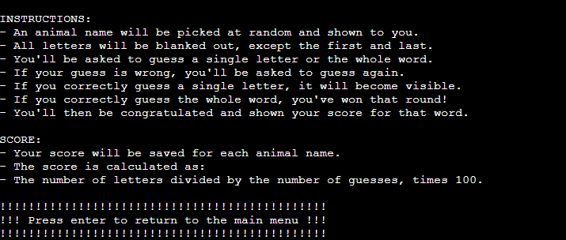
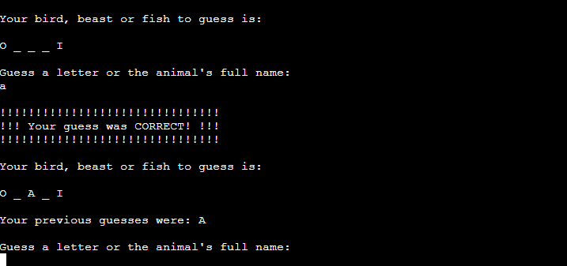
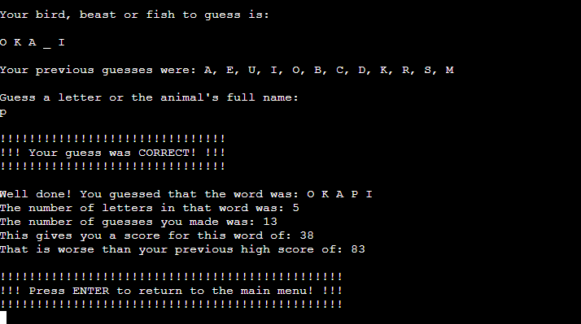

# Birds, Beasts and Fishes

- [Birds, Beasts and Fishes (deployed on Heroku)](https://birds-beasts-fishes-428a18feeb9b.herokuapp.com/) 

Birds, Beasts and Fishes is a command line word game for children of (almost) all ages.

It is based on a chalk-and-slate game of the same name, described in Alice Gomme’s 1894 book, The Traditional Games of England, Scotland and Ireland.

You can read [the original 1894 description](https://www.gutenberg.org/files/41727/41727-h/41727-h.htm#GameI_50)  online, thanks The Gutenberg Project.

The game is similar to the more popular Hangman game. The player is given a word with all of the letters blanked out, except for the first and last letter. The player guesses either single letters or the whole word, with the aim being to guess the word in as few guesses as possible.

As the title suggests, all words are the names of birds, beasts or fishes (or animals more generally). In addition to just being fun, the game aims to get more children interested in the natural world, animals, language and the joy of solving puzzles.

## User Experience Design

I designed the program using the "five planes" UX design process.

### Strategic Plane

#### Product Owner Goals

- Primary goal:
  - To inspire children of (almost) all ages to take an interest in the natural world, animals, language and puzzles
- Secondary goals:
  - To improve the player’s spelling skills
  - To give players a calming way to enjoy their spare time.

#### User goals

- Primary goal:
  - To play a fun game
- Secondary goals:
  - To test their spelling abilities
  - To learn some new facts about animals
  - To have an alternative to hyperactive video games

### Scope Plane

#### User stories

1. As a user, I want to see a simple text-based interface so I’m not distracted by vivid sounds or images while playing the game.
2. As a user, I want to be able to read the game’s instructions so I know how to play.
3. As a user, I want to play a simple word game that is fun, challenging and educational.
4. As a user, I want to increase my understanding of animals and nature.
5. As a user, I want to see my previous scores, so I can see if I’m improving.

### Structure Plane

To fulfil the user stories, the user interface has repeating text structures (e.g. sentences, blocks, menus) that take user input, provide feedback and show the user their progress through the game.

The main structural elements of the user interface are:

- Game Title
- Main Menu
- Instructions
- Game Screen (which consists of multiple sub-elements)
- Win Message
- Exit Message

The original design for the flow of control through these elements is shown in the flow chart below. There are minor differences between this flowchart and the final game, due to user feedback.

### Skeleton Plane

The wireframe below show the conceptual design for each of the user interface's main structural elements. As this game is only available in the terminal, there are no wireframes specifically for tablets or mobile devices. There are minor differences between the wireframes and the final game, due to user feedback.

### Surface Plane

#### Colour palette

Although it is possible to show colours in the terminal, I decided to keep the game’s design simple by using the default text and background colours (typically white and black, respectively).

#### Custom fonts

The game uses the terminal's default font for all text, except for the game's title. The game's title uses the ASCII Art Library For Python to produce a large and attention-grabbing font.

- [ASCII Art Library For Python](https://pypi.org/project/art/)

#### Content

As a simple word game, the program has little in the way of written content, other than the text that makes up the structural elements of the user interface. 

The animal names are fetched from the Internet via GitHub:

- [List of Animal Names on GitHub in JSON format](https://gist.github.com/borlaym/585e2e09dd6abd9b0d0a)

## Technologies Used

### Languages

- [Python](https://www.python.org/)

### Installed Python Libraries

- [art (ASCII Art Library For Python)](https://pypi.org/project/art/)
- [requests (Python HTTP for Humans)](https://pypi.org/project/requests/)
- [gspread (Google Spreadsheets Python API)](https://pypi.org/project/gspread/)
- [google-auth (Google Authentication Library)](https://pypi.org/project/google-auth/)
- (plus required dependencies of the above libraries)

### Other Technologies
- [Google Sheets](https://workspace.google.com/products/sheets/)

## Features

### Implemented Features

#### Game Title

- When the game first loads, the user is shown the game's title and sub-title.
- The title uses ASCII art to produce a very large font, which makes the "loading screen" more engaging for younger players.
- This is useful to users because the title clearly tells them which game they've launched, and the sub-title tells them that they're about to play an animal-based word game.

#### Main Menu

- The main menu is shown at the start of each game (a "game" consists of one round, and ends when a word has been guessed).
- It has a heading with a thick border to separate it from any preceding text, and so the user knows they're being asked something important (the border is made of question marks).
- Under the heading, the user is presented with options to play the game, read the instructions, or exit the game.
- This is useful to users because it gives them an opportunity to read the instructions before playing a new round, or exiting if they don't want to play.

#### Instructions

- The game includes an instructions section, which is accessible from the main menu.
- The instructions section explains how the game works and how the game's scoring system works.
- The user can return to the main menu by pressing enter.
- This is useful to users because it tells them how to play the game, and how to get a higher score (guess long words in as few guesses as possible).

####  Game Screen

- If the user chooses the "Play game" option from the main menu, they will enter the main game screen.
- The game screen shows the user a random animal name to guess, with most of the letters hidden. The user is prompted to enter their guess.
- When a guess is entered, the user will be shown one of several sections depending on whether their guess was invalid, matched an existing guess, or was correct. You can see screenshots for each of these in the testing section.
- After a valid guess is entered, this section is shown again, but the correctly guessed letters will now be visible, along with a list of previous guesses.
- This is useful to users because it enables them to: (a) see the word they have to guess, (b) enter guesses, and (c) get feedback on their guess. Without this feature, there is no game.

#### Win Message

- This section is shown when the user guesses the word and wins the game.
- It shows the user the full word, so they know which animal name they guessed, even if they guessed letter-by-letter.
- It shows the user their score, and breaks down how that score was achieved (the number of letters in the word and the number of guesses). It also tells them how their score compares to their previous high score for that word.
- Users can exit this round of the game and return to the main menu by pressing enter.
- This section is useful to users because it rewards them with positive feedback on their efforts, and tells them if they beat their previous high score or not.

#### Exit Message

- This section is shown to users when the choose the Exit option from the main menu.
- A message is displayed thanking the user for playing. This may create a feeling of goodwill towards the game and increase the odds of them playing again.
- This section is useful to users because it gives them clear feedback that they are leaving the game.

### Future Features

#### Animal Descriptions

- When the user correctly guesses an animal name, a detailed description of that animal is displayed (fetched from a relevant dictionary-like web API).
- This feature was included in the design stage but wasn't implemented in this iteration due to time constraints.

#### Multiple User High Scores

- The user is able to enter a username so that the game can record different high scores for different users. This allows players to compete against one another on the same machine, which isn't currently possible.
- This is a relatively simple feature that is a good candidate for the next development iteration.

## Data Model

The program uses a `Game` class to manage the state of the game, with instance variables for the word to guess, the masked word (showing which letters are hidden) and the player's previous guesses.

`Game` has the following methods to enable the user interface to interact with and change the state of the game:

- `.make_guess()` - makes a new guess and returns whether the guess was correct
- `.is_over()` - returns whether the game is over
- `.final_score()` - returns the game's final score

## Testing

The game was thoroughly tested, with all tests documented in [testing.md](docs/testing.md).

## Deployment

Birds, Beasts and Fishes is a text-based game, designed to be played locally in the terminal. For demonstration purposes, it has also been deployed to the Internet via [Heroku](https://www.heroku.com/) using [Code Institute](https://codeinstitute.net/)'s mock terminal for the Web.

- [Birds, Beasts and Fishes (play the game on Heroku)](https://birds-beasts-fishes-428a18feeb9b.herokuapp.com/)

This project can be cloned to make a copy on your local machine or forked to make a copy on your GitHub account.

### Cloning

You can clone the repository using these steps:

1. Go to the [GitHub repository](https://github.com/John-Kingham/birds-beasts-fishes).
2. Click on the green Code button near the top.
3. Select whether you prefer to clone using HTTPS, SSH, or GitHub CLI, and copy the URL to your clipboard.
4. On your local machine, open your terminal (or Git Bash, depending on your operating system).
5. Change the current working directory to the location where you want the cloned directory.
6. In your terminal, type the following command to clone the repository:
	- `git clone https://github.com/John-Kingham/birds-beasts-fishes.git`
7. Press Enter to create your local clone.

### Forking

By forking the GitHub Repository, you make a copy of the original repository on your GitHub account to view and/or make changes without affecting the original repository. You can fork this repository by using the following steps:

1. Log in to GitHub and locate the [GitHub repository](https://github.com/John-Kingham/birds-beasts-fishes).
2. At the top of the repository, click the Fork button.
3. You should now have a copy of the original repository in your own GitHub account.

### Google Sheet Setup

The game uses a [Google Sheet](https://workspace.google.com/products/sheets/) to store high scores. To deploy the game locally or remotely, you will need to set up a Google Sheet using the steps below:

1. In your Google account, create a Google Sheet called "birds_beasts_fishes". It should have a sheet called "scores", with two columns called "word" and "score".
2. Go to the [Google Cloud Platform](https://console.cloud.google.com/) and set up a new project.
3. In that project, enable the APIs for Google Drive and Google Sheets.
4. Create an Editor service account and a JSON credentials file for the Google Drive API, and save the credentials to your local machine.
5. In Google Sheets, share your Google Sheet with the email labelled as client_email in the credentials file. Give the email Editor access so the game can update the spreadsheet.

These steps are missing some details that are beyond the scope of this document. If you need additional information to set up access to your Google Sheet, you should read the official Google Sheets and/or Google Cloud Platform documentation.

### Local Deployment

To deploy the game locally, you will need to install required libraries and set up access to your Google Sheet.

1. Clone the remote repository to your local machine.
2. Start a Python virtual environment of your choice (to avoid loading required libraries into your global environment).
3. Run `pip install -r requirements.txt` to install required libraries.
4. If you haven't already, follow the steps in the Google Sheet Setup section above.
5. Move/copy the Google Drive API credentials file into the local repository's root directory and rename it to creds.json.
6. Call run.py. 
7. The game should run and have read/write access to your Google Sheet.

### Deployment to Heroku

The game can also be deployed to Heroku by following the steps below.

1. In your Heroku account, create a new app.
2. Add two config variables:
   - KEY=PORT, VALUE=8000
   - KEY=CREDS, VALUE=the contents of the Google Drive API credentials file
3. Add buildpacks for Python and Node.js in that order.
4. Connect the Heroku app to your GitHub repository.
5. Deploy the main branch in Heroku.
6. Wait for the site to deploy and then visit the deployed site to check that it has deployed correctly.

These steps require knowledge of Heroku that is beyond the scope of this document. If you need additional information to set up your Heroku deployment, you should read the official Heroku documentation.

## Credits

### User Experience Design

### Strategy Plane

- I used the five planes method (Strategy, Scope, Structure, Skeleton, Surface), as detailed in [The Elements of User Experience](http://www.jjg.net/elements/).

#### Structure Plane

- I used [Lucidchart](https://www.lucidchart.com/) to create the high level structure and navigation of the user interface.

#### Skeleton Plane

- I built wireframes for the main screen elements using [Balsamiq](https://balsamiq.com/).

#### Surface Plane

- I used the [ASCII Art Library For Python](https://pypi.org/project/art/) to create a large font for the game's title.
- The animal names are fetched from a [list of animal names on GitHub](https://gist.github.com/borlaym/585e2e09dd6abd9b0d0a).

### Development

- I wrote the project's code using [Visual Studio Code](https://code.visualstudio.com/).
- I used [W3Schools](https://www.w3schools.com/), [Code Institute](https://codeinstitute.net/), [Codecademy](https://www.codecademy.com/) and [Microsoft Copilot](https://copilot.microsoft.com/) for general referencing.
- I learned about Python Requests, property decorators, Enums and other more advanced Python features from Codecademy.
- I learned about Python modules from my mentor.
- Although I used various information sources to support the development of this project, no external code was copy/pasted into the project or copied verbatim. 

### Documentation

- I used [Code Institute's README.md template](https://github.com/Code-Institute-Solutions/readme-template/blob/master/README.md) as the starting point for this document.
- I used [Am I Responsive](https://ui.dev/amiresponsive) to generate the multi-screen image shown at the start of the README.

## People

- Last but not least, I would like to thank my mentor, [Simen Daehlin](https://github.com/Eventyret).