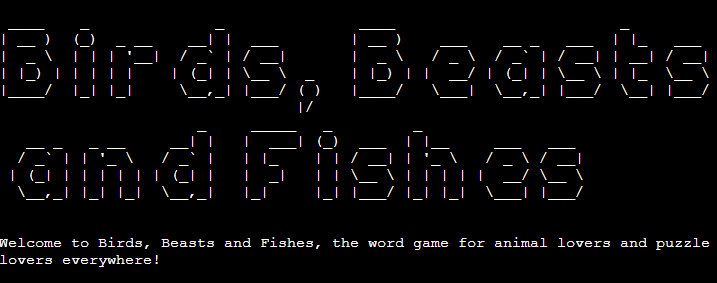
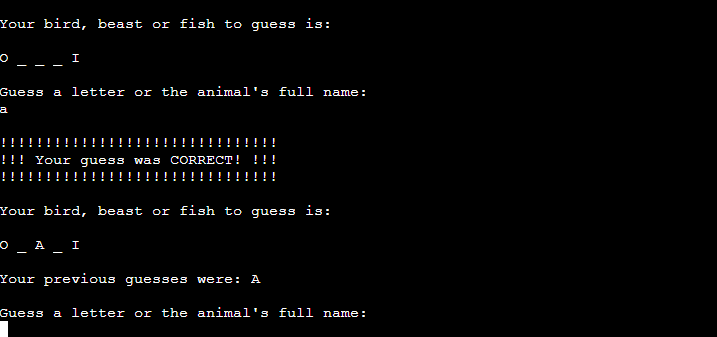
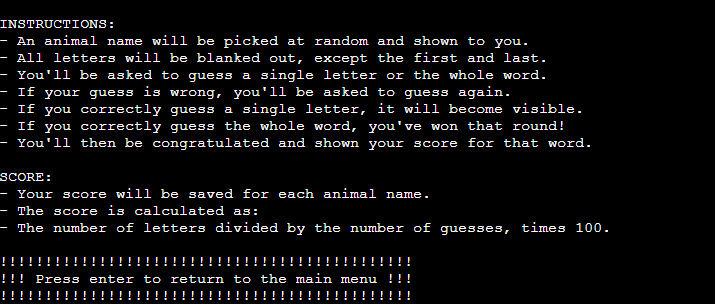
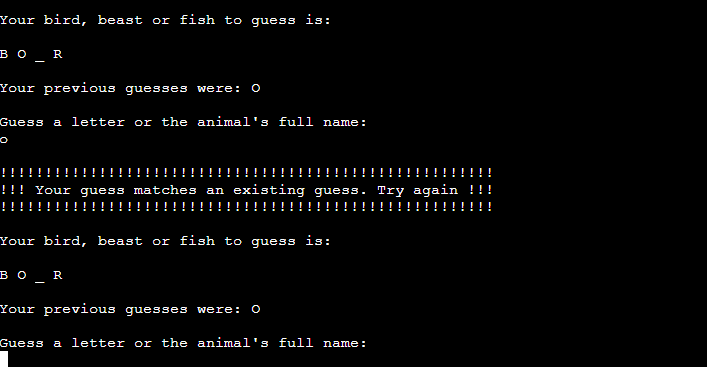
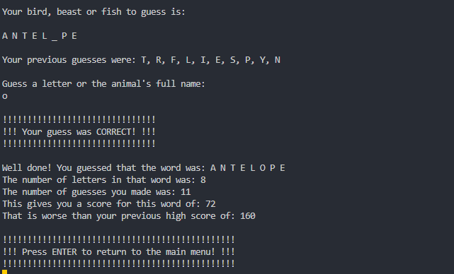

# Birds, Beasts and Fishes - Manual Testing

## Functionality

### Game Launch Functionality

|Feature|Expect|Action|Result|Image
|---|---|---|---|---|
|Game Title|When the game is first launched, the Game Title is shown|Launched game|As expected||
|Main Menu|When the game is first launched, the Main Menu is shown after the Game Title|Launched game|As expected||

### Main Menu Functionality

|Feature|Expect|Action|Result|Image
|---|---|---|---|---|
|Menu option 1 ("Play game")|When chosen, the Game Screen section is shown|Selected option 1|As expected||
|Menu option 2 ("Read instructions")|When chosen, the Instructions section is shown|Selected option 2|As expected||
|Menu option 3 ("Exit")|When chosen, the Exit Message is shown and the program exits|Selected option 3|As expected||
|Menu option validation|When an invalid option is entered, an error message is shown and the Main Menu is redisplayed|Entered an invalid option|As expected||

### Instructions Functionality

|Feature|Expect|Action|Result|Image
|---|---|---|---|---|
|Return to Main Menu|When enter is pressed from the Instructions section, the Main Menu is shown|Pressed enter|As expected||

### Game Screen Functionality

|Feature|Expect|Action|Result|Image
|---|---|---|---|---|
|Incorrect guess|When an incorrect guess is entered, a relevant message is shown and the Game Screen text is redisplayed; the word to guess is unchanged and the list of previous guesses includes the incorrect guess|Entered an incorrect guess|As expected||
|Invalid guess|When an invalid (non-alphabetical) guess is entered, a relevant message is shown and the Game Screen text is redisplayed; the word to guess and list of previous guesses are unchanged|Entered an invalid guess|As expected||
|Repeated guess|When a repeated guess is entered, a relevant message is shown and the Game Screen text is redisplayed; the word to guess and list of previous guesses are unchanged|Entered the same guess twice|As expected||
|Correct letter guess|When a correct letter is entered, a relevant message is shown and the Game Screen text is redisplayed; the word to guess and list of previous guesses are updated to include the letter|Entered a correct letter|As expected||
|Correct word guess|When a correct animal name guess is entered, the Win Message section is shown|Entered a correct animal name guess|As expected||

### Win Message Functionality

|Feature|Expect|Action|Result|Image
|---|---|---|---|---|
|High score comparison|When a word that has already been played is guessed again, the current score is compared to the high score|Guessed a previously guessed word|As expected||
|Return to Main Menu|When enter is pressed from the Win Message section, the Main Menu is shown|Pressed enter|As expected||

## Responsiveness

This game is designed to be played in the terminal, so its responsiveness to different screen sizes was not a major design concern and was not tested.

## Code Validation

### Python Validation

Python code was validated using the [Code Institute Python Linter](https://pep8ci.herokuapp.com/).

#### run.py Validation

All clear, no errors found.

#### src/game.py Validation

All clear, no errors found.

#### src/data/database.py Validation

All clear, no errors found.

#### src/data/github_api.py Validation

All clear, no errors found.

#### src/data/google_api.py Validation

All clear, no errors found.

#### src/tui/content.py Validation

All clear, no errors found.

#### src/tui/interface.py Validation

All clear, no errors found.

## Unfixed Bugs

There are no unfixed bugs that I am aware of. Having said that, even after thorough testing I cannot completely rule out the possibility of some hidden bugs.